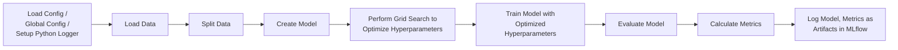

# MLFlow Config Driven Framework

This project provides a configurable and extensible framework for machine learning workflows using MLFlow, a platform for the complete machine learning lifecycle. The framework allows users to define the details of an experiment, such as the dataset to use, the machine learning model to train, and the evaluation metrics to compute, all via a configuration file. The project provides support for various data sources, machine learning libraries, and model architectures, and it incorporates unit tests to ensure code quality and functionality.

## Installation
- Clone the repository from GitHub.
- Navigate to the cloned repository.
- Install the required Python packages using pip:
- Copy code
```bash
pip install -r requirements.txt
```
## Pipeline



## Project Structure
The project directory is organised as follows:
```bash
mlflow_config/
│
├── .github/
│   ├── actions/
│   └── scripts/
│
├── configs/
│   ├── config_iris.json
│   ├── config_wine.json
│   └── global_config.json
│
├── functions/
│   ├── config_loader.py
│   ├── config_mapping.py
│   ├── data_loader.py
│   ├── data_splitter.py
│   ├── evaluation_metrics.py
│   ├── evaluation_runner.py
│   ├── mlflow_logger.py
│   ├── model_runner.py
│   └── run_manager.py
│
└── main_mlflow.py
```

## Configuration
- Configuration files (`configs/`): These JSON files provide the specifications for each experiment. The user can specify the data source, dataset name, model library, model name, parameters for model tuning, evaluation metrics, and more. 
- The `global_config.json` contains global configurations such as the Python logging file name and the temporary subdirectory folder name.

## Functions (functions/):

- `config_loader.py` loads the JSON configuration file, retrieves the value of a specific key in the configuration, and loads the full configuration.
- `config_mapping.py` provides the mapping of configuration parameters to their default values.
- `data_loader.py` provides classes to load data from various sources, including sklearn datasets, CSV files, and Azure SQL. It also includes commented-out code for potential future support for Databricks Delta Lake and Snowflake.
- `data_splitter.py` provides a function to split the dataset into training, validation, and testing sets.
- `evaluation_metrics.py` provides classes to calculate various evaluation metrics, including accuracy, precision, recall, F1 score, and RMSE.
- `evaluation_runner.py` provides a function to perform grid search for hyperparameter tuning.
- `mlflow_logger.py` provides functions to set up the Python logger and log artifacts in MLflow.
- `model_runner.py` provides classes to create models from the LightGBM library.
- `run_manager.py` provides a function to set up the MLflow run.
- Main script (`main_mlflow.py`): The main entry point of the project that calls functions from the functions/ directory to execute the machine learning workflow based on the specified configuration.

## GitHub Actions
- GitHub Actions is used for automating the workflow for continuous integration and deployment. When code is pushed to the repository, GitHub Actions automatically triggers scripts defined in `.github/actions/` directory to run unit and functional tests to validate the integrity of the codebase.
- The `run_categorisation.sh` and `run_regression.sh` scripts in the `.github/scripts/` directory are used for running functional tests on a sample categorisation and regression task, respectively. These scripts execute the main script (`main_mlflow.py`) with specific configuration files to simulate actual ML workflows.